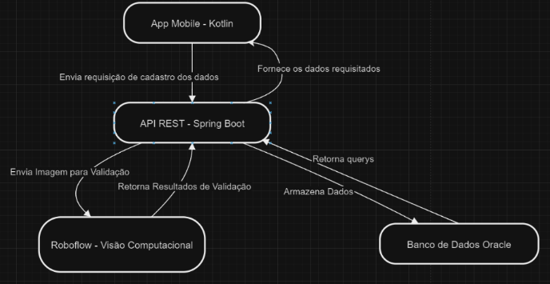

# Faculdade de Informática e Administração Paulista 
 

## Gustavo Araújo Maia RM553270

## Rafael Vida Fernandes RM553721

## Kauã Almeida Silveira RM552618

### RESUMO 

Com base nos conhecimentos adquiridos em sala de aula, o projeto visa desenvolver um serviço de validação e documentação de procedimentos odontológicos, com o objetivo de reduzir e prevenir fraudes em sinistros. A solução proposta integra-se aos sistemas de gestão já utilizados pela OdontoPrev, utilizando imagens capturadas pelos dentistas antes e após cada procedimento. 

Essas imagens serão processadas por meio de visão computacional, que verifica a autenticidade e a conformidade do procedimento realizado. Ao garantir que o procedimento realmente ocorreu e foi registrado corretamente, buscamos prevenir a ocorrência de sinistros fraudulentos, onde consultas podem ser reportadas sem que tenham sido efetivamente realizadas. 
 

### DESCRIÇÃO DO PROBLEMA A RESOLVER 

O problema identificado é a falta de validação eficaz e documentação dos procedimentos odontológicos, o que facilita a ocorrência de fraudes em sinistros. Atualmente, tanto clientes quanto dentistas têm a possibilidade de falsificar ou exagerar procedimentos, resultando em registros de consultas desnecessárias ou inexistentes, o que prejudica a confiança no processo e gera perdas financeiras para a OdontoPrev. 

 

### OBJETIVOS DA SOLUÇÃO IDEALIZADA 

A solução proposta tem como objetivo adicionar uma camada extra de segurança ao processo de validação e documentação dos procedimentos odontológicos. Utilizando visão computacional, o serviço garante que o procedimento foi realizado corretamente, por meio da análise das imagens tiradas no início e no fim de cada atendimento. 

Com a documentação das validações, o sistema não apenas proporciona maior segurança, mas também contribui para a prevenção de fraudes em sinistros, uma vez que os dados validados podem ser usados para verificar a autenticidade de qualquer consulta ou urgência reportada. 

### FERRAMENTAS UTILIZADAS E COMO SERÃO APLICADAS 

Para implementar a solução de visão computacional, utilizaremos o Roboflow, uma plataforma avançada que facilita a criação, treinamento e integração de modelos de IA para processamento de imagens. O Roboflow foi escolhido pela sua capacidade de simplificar o processo de treinamento de modelos e pela facilidade de integração com sistemas existentes. 

#### API do Roboflow e Integração com Sistemas 

Uma das principais vantagens do Roboflow é sua API poderosa, que permite a integração direta do modelo de visão computacional com o back-end do nosso serviço, sem a necessidade de intervenções manuais. Isso facilita a automação do processo de validação das imagens capturadas pelos dentistas. 

A API oferece funcionalidades que incluem: 

Envio e recebimento de imagens para análise em tempo real; 

Treinamento e ajuste de modelos diretamente na plataforma Roboflow, com suporte a diferentes tipos de dados (imagens, anotações e metadados); 

Atualização automática do modelo, permitindo que ele se refine continuamente com novas imagens e anotações, otimizando os resultados ao longo do tempo. 

#### Treinamento de Dados e Customização 

Uma das grandes vantagens do Roboflow é a facilidade com que ele permite a preparação e anotação de dados. O processo de treinamento do modelo é mais eficiente e customizável em comparação com outras ferramentas. A plataforma oferece recursos como: 

Ferramentas de anotação personalizadas, que nos permitem marcar áreas específicas das imagens (como dentes, aparelhos e instrumentos), tornando o modelo mais preciso. 

Facilidade para combinar e gerar novas imagens, o que ajuda a aumentar a base de dados de treinamento, especialmente quando as imagens disponíveis são limitadas. Esse processo aumenta a robustez do modelo, tornando-o capaz de identificar uma maior variedade de cenários e situações. 

Ajustes contínuos e validação do modelo: Durante o processo de treinamento, podemos facilmente iterar e melhorar o modelo com base nos resultados, o que garante que ele se torne cada vez mais eficiente na detecção de fraudes. 

 

### DESENHO MACRO DA APLICAÇÃO E INTEGRAÇÃO COM O ROBOFLOW 

 

## EVOLUÇÃO EM RELAÇÃO À PRIMEIRA ENTREGA 

Na primeira sprint, o foco foi entender os requisitos do projeto, definir a arquitetura da solução e criar um esboço inicial. Nesta fase, buscamos estabelecer uma base sólida para o desenvolvimento. 

Na segunda sprint, criamos nosso MVP. O MVP permite, pela primeira vez, a validação prática da solução. Agora, temos um modelo funcional que identifica e valida os procedimentos odontológicos com base nas imagens enviadas. A transição da fase conceitual para a execução foi bem-sucedida. 

Principais avanços: 

Da concepção à execução: Saímos de um modelo conceitual para uma versão funcional que já é capaz de processar imagens e realizar validações básicas de procedimentos odontológicos. 

Aprendizado e iteração: Durante o desenvolvimento do MVP, surgiram novos desafios e oportunidades de aprimoramento. O principal desafio foi melhorar a qualidade da base de dados, ajustando as anotações e aumentando a diversidade das imagens para garantir um treinamento mais robusto. Esses ajustes permitiram aprimorar a precisão do modelo. 

 

### REPOSITÓRIO 

https://github.com/ChallengeOdontoPrev/generativeIA 

 

### LINK DO MODELO NO ROBOFLOW: 

https://universe.roboflow.com/workspace-sfj9d/aparelho-dentario/model/1 

 

### LINK DO VÍDEO 

https://www.youtube.com/watch?v=Hit9SsLRx1E

 

 
